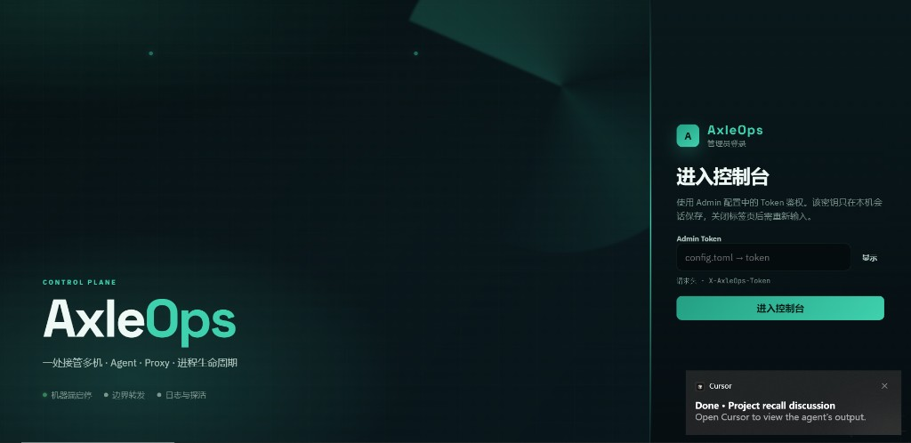
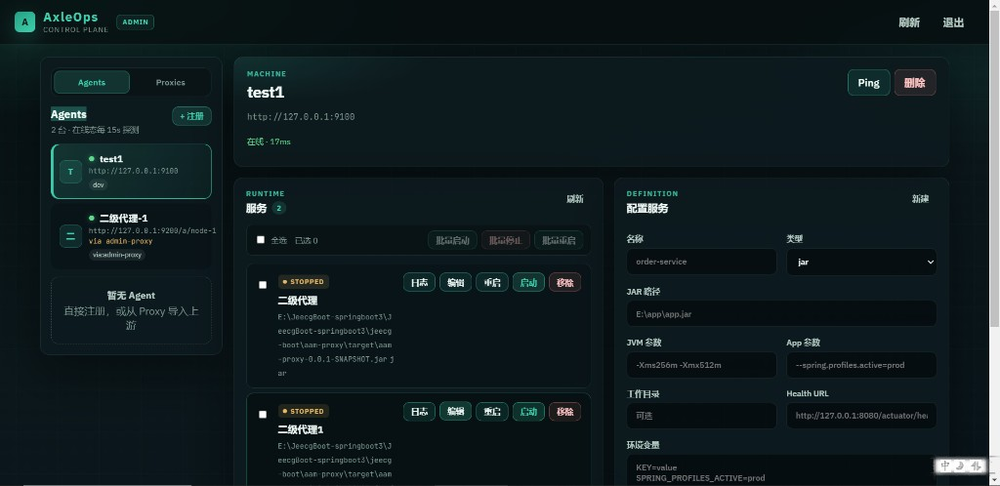

# AxleOps

[](LICENSE)
[](https://github.com/lvpenglive/axleops/releases)

微服务及其他服务启停管理：支持 JAR、shell / Python 等脚本和通用命令。

**当前版本：v0.4.1**（见 [CHANGELOG](CHANGELOG.md)）

- Agent：机器端进程生命周期（启停、日志、探活、制品发布）
- Admin：控制面 + Web 控制台 + SQLite Agent 注册
- Proxy：Admin 与 Agent 之间的边界转发（跨网区）

仓库：https://github.com/lvpenglive/axleops  

文档：[贡献指南](CONTRIBUTING.md) · [安全策略](SECURITY.md) · [部署脚本](deploy/README.md)

## 预览





## 结构

| 目录 | 说明 |
|------|------|
| `axleops-agent/` | 机器端 Agent，默认 `0.0.0.0:9100` |
| `axleops-admin/` | 控制面与静态 UI，默认 `0.0.0.0:9000` |
| `deploy/` | Linux systemd / Windows 服务 / Docker Compose 安装 |

Admin 控制台左侧可切换 **Agents / Proxies**：登记多个 Proxy 后 Ping、拉取上游，并可一键导入为 Agent。

## 版本功能计划

当前发布版本为 **v0.4.1**。详细变更见 [CHANGELOG.md](CHANGELOG.md)。

### v0.1 — 基线（已完成）

- Agent：JAR / 脚本 / 命令启停，规格持久化，日志，env，health 探活，重启 / 删除
- Admin：Token 登录，Agent 注册，API 代理，Web 控制台
- Proxy：`/a/{id}/*` 转发、Proxy Token 鉴权、上游 Agent token 注入、上游列表 API
- 配置：`config.toml` + 环境变量覆盖；运行数据与密钥不入库

### v0.2 — 控制台打磨（已完成）

- ~~Agent / Proxy 在线态（定时 ping + 指示灯）~~
- ~~日志 UX：自动刷新、尾部跟随~~
- ~~同机批量启停 / 重启~~
- ~~表单与代理错误提示增强~~
- ~~README / `config.example.toml` 与实现字段对齐维护~~

额外已落地（同期）：Proxy 管理页与页面配置下游、登录页改版（仍为 Token）。

### v0.3 — 可靠与安全

- ~~**用户名 / 密码登录**（会话鉴权，替代整站共用 Admin Token 登录）~~
- ~~**改密**；超管可创建 / 禁用用户（种子管理员可从配置引导）~~
- ~~**操作审计**：绑定用户（谁、何时、对哪台 Agent/Proxy 做了启停 / 导入等）~~
- ~~Agent / Proxy 侧 Token 轮换（Admin 登记轮换 + Agent `rotate-token` 热更）~~
- ~~生产 CORS 策略（`cors_origins`；空/`*` 为开发宽松模式）~~
- ~~跨 Agent 服务状态总览~~
- ~~Agent 重启后按规格拉起「应运行」服务~~
- ~~**业务进程崩溃自动拉起**（Agent 侧看门狗：PID 消失后按规格拉起，可配置间隔；探活 Unhealthy 暂不自动杀进程以免抖动）~~
- ~~基础自动化测试（Agent 单元测试 + CI `cargo test`）~~

已落地补充：Admin 仍接受 `X-AxleOps-Token` 作为自动化服务令牌；浏览器走会话（`X-AxleOps-Session` / Bearer）。
控制台「总览」聚合各 Agent 服务；Admin 可轮换登记 Token（可选 sync 到 Agent）；`cors_origins` 控制生产 CORS；Agent 侧 `POST /api/v1/auth/rotate-token` + `data/auth.token` 热更。

### v0.4 — 交付与部署增强

- ~~制品上传 / 版本号（JAR 换包后启停）~~
- ~~简单发布：停 → 换文件 → 启；可选回滚~~
- ~~Windows 服务 / Linux systemd 安装脚本~~（`deploy/`）
- ~~可选 Docker / 一键安装包~~（`docker compose` + `deploy/docker/up.sh`）

制品：Agent `data/artifacts/{service}/{version}/`；API `…/artifacts`、`…/publish`、`…/rollback`；控制台服务行「制品」。
Docker：见 `deploy/docker/README.md`；宿主机进程管理仍推荐 systemd / Windows 服务。

### v0.5+ — 远期

依赖图与顺序启停、告警（钉钉 / 企微）、细粒度 RBAC、Admin 侧规格镜像、多环境（dev / staging / prod）

**建议落地顺序：** v0.2 → v0.3 → v0.4（已完成）→ 有告警 / 多服务编排需求再开 v0.5+。

生产上线前请过一遍 [SECURITY.md 检查清单](SECURITY.md#production-checklist生产上线前)。

---

## 实施与部署步骤

### 0. 环境要求

- Rust 工具链（建议 stable）：https://rustup.rs
- Windows / Linux 均可；业务机需能执行目标 JAR / 脚本 / 命令
- **直连模式**：Admin 与各 Agent 网络互通（默认 Admin `9000`，Agent `9100`）
- **跨网区模式**：Admin 只通向 Proxy（`9200`），Proxy 再通向各业务区 Agent

### 1. 获取代码

```bash
git clone https://github.com/lvpenglive/axleops.git
cd axleops
```

### 2. 配置（务必修改默认口令 / Token）

本地 `config.toml` **不入库**，从示例复制：

**Agent（每台业务机一份）：**

```bash
cd axleops-agent
cp config.example.toml config.toml
```

```toml
bind = "0.0.0.0:9100"
token = "改成足够长的随机密钥"   # 请求头 X-AxleOps-Token
data_dir = "./data"
watchdog_enabled = true
watchdog_interval_secs = 15
```

环境变量覆盖（可选）：`AXLEOPS_BIND` / `AXLEOPS_TOKEN` / `AXLEOPS_DATA_DIR` / `AXLEOPS_WATCHDOG_*`

**Admin（一台控制机）：**

```bash
cd axleops-admin
cp config.example.toml config.toml
```

```toml
bind = "0.0.0.0:9000"
token = "改成足够长的随机密钥"   # 自动化 / 服务令牌（X-AxleOps-Token），非浏览器登录
data_dir = "./data"
seed_username = "admin"
seed_password = "改成强密码"      # 首次空库自动创建该管理员
session_ttl_hours = 24
```

环境变量覆盖（可选）：`AXLEOPS_ADMIN_BIND` / `AXLEOPS_ADMIN_TOKEN` / `AXLEOPS_ADMIN_DATA_DIR` / `AXLEOPS_ADMIN_SEED_*` / `AXLEOPS_ADMIN_SESSION_TTL_HOURS`

> 浏览器用用户名密码登录；Admin `token` 与 Agent Token 各自独立。直连时，注册 Agent 填该 Agent 的 `base_url` 与其 Token。

**Proxy（可选，边界 / 二级机）：**

```bash
cd axleops-proxy
cp config.example.toml config.toml
```

```toml
bind = "0.0.0.0:9200"
token = "改成-proxy-密钥"        # Admin→Proxy 使用；注册时填这个 token
timeout_secs = 120

[[agents]]
id = "node-01"
name = "prod-node-01"
base_url = "http://10.0.1.11:9100"   # Proxy→Agent 可达地址
token = "agent-secret-on-node-01"    # 仅保存在 Proxy，不进 Admin
```

环境变量覆盖（可选）：`AXLEOPS_PROXY_BIND` / `AXLEOPS_PROXY_TOKEN` / `AXLEOPS_PROXY_TIMEOUT_SECS`

经 Proxy 访问时，Admin 注册示例：

| 字段 | 值 |
|------|-----|
| Base URL | `http://<proxy-host>:9200/a/node-01` |
| Token | **Proxy** 的 `token`（不是 Agent token） |

拓扑：`浏览器 → Admin → Proxy → Agent`。下游 Agent 密钥写在 Proxy 的 `data/upstreams.json`（或管理页配置）；配置文件 `[[agents]]` 仅首次种子。

### 3. 开发态启动（本机联调）

**直连（无 Proxy）：**

终端 1 — Agent：`cd axleops-agent && cargo run`  
终端 2 — Admin：`cd axleops-admin && cargo run`  
注册：`http://127.0.0.1:9100` + Agent Token。

**经 Proxy：**

```bash
# 终端 1
cd axleops-agent && cargo run
# 终端 2（config 里 base_url 指向 http://127.0.0.1:9100）
cd axleops-proxy && cargo run
# 终端 3
cd axleops-admin && cargo run
```

注册 Base URL：`http://127.0.0.1:9200/a/node-01`，Token：Proxy token。  
可先：`curl -H "X-AxleOps-Token: <proxy-token>" http://127.0.0.1:9200/api/v1/upstreams`

1. 浏览器打开 http://127.0.0.1:9000/
2. 使用 `seed_username` / `seed_password`（或已创建用户）登录
3. 按上表注册 Agent（直连或 Proxy 前缀）
4. 保存服务规格后启停 / 日志 / 探活

### 4. 生产 / 联机部署（推荐 release）

#### Linux 包（GitHub Actions）

推送到 `main`、打 `v*` 标签，或在 Actions 里手动 **Run workflow**，会打两套 `x86_64` 产物：

| Artifact | 说明 |
|----------|------|
| `axleops-linux-x86_64.tar.gz` | Ubuntu runner 通用 Linux（glibc 较新） |
| `axleops-kylin-v10-sp3-x86_64.tar.gz` | 在社区镜像 `hxsoong/kylin:v10-sp3` 内编译，贴近银河麒麟 V10 SP3 |

每包含 agent / admin[+static] / proxy + example 配置。标签发布时两套都会挂到 GitHub Release。

> GitHub 没有官方麒麟 runner；麒麟包是在该 SP3 容器里编的，用于在 V10 SP3 上更稳地运行。若你有真实麒麟机，也可挂 **self-hosted runner** 做同机构建。

解压后在各目录复制 `config.example.toml` → `config.toml`，再启动对应二进制。麒麟环境请优先用 `kylin-v10-sp3` 那包。

#### 本机编译

在**构建机**上编译（或各机分别编译）：

```bash
cd axleops-agent && cargo build --release
# 产物：target/release/axleops-agent(.exe)

cd ../axleops-admin && cargo build --release
# 产物：target/release/axleops-admin(.exe)

cd ../axleops-proxy && cargo build --release
# 产物：target/release/axleops-proxy(.exe)
```

Windows 要打 Linux 包时，优先用上面的 Actions，或在 WSL 里执行相同命令。
**部署目录建议：**

```text
/opt/axleops/agent/          # 业务机
  axleops-agent(.exe)
  config.toml
  data/

/opt/axleops/proxy/          # 二级 / 边界机（可选）
  axleops-proxy(.exe)
  config.toml                # 含各 [[agents]]

/opt/axleops/admin/          # 控制机
  axleops-admin(.exe)
  config.toml
  static/
  data/
```

注意：

- Admin 的静态页面在 `axleops-admin/static/`，须与二进制同工作目录启动。
- `data/` 与含真实 Token 的 `config.toml` 不要提交 Git；Proxy 配置含全部下游 Agent 密钥，权限要收紧。

**启动示例：**

```bash
# Linux / macOS（前台）
cd /opt/axleops/agent && ./axleops-agent
cd /opt/axleops/proxy && ./axleops-proxy
cd /opt/axleops/admin && ./axleops-admin

# Windows（PowerShell 前台）
cd E:\axleops\agent; .\axleops-agent.exe
cd E:\axleops\proxy; .\axleops-proxy.exe
cd E:\axleops\admin; .\axleops-admin.exe
```

#### 安装为系统服务（推荐生产）

解压发布包或在仓库根目录执行（需已有 release 二进制，或包内 `agent/` / `admin/` / `proxy/`）：

**Linux（systemd）：**

```bash
# 默认安装到 /opt/axleops/<组件>，创建系统用户 axleops，并 enable
sudo ./deploy/linux/install.sh agent --start
sudo ./deploy/linux/install.sh admin --start
# 可选
sudo ./deploy/linux/install.sh proxy --start

systemctl status axleops-agent
journalctl -u axleops-admin -f

# 卸载（加 --purge 删除安装目录）
sudo ./deploy/linux/uninstall.sh agent
```

Agent 若以非 root 运行，需保证其对业务 JAR / 脚本路径有读和执行权限；也可用 `sudo ./deploy/linux/install.sh agent --user root --start`。

**Windows（管理员 PowerShell）：**

```powershell
# 默认安装到 C:\axleops\<组件>
# 若本机有 NSSM 则注册为 Windows 服务；否则注册开机 Scheduled Task
.\deploy\windows\install.ps1 -Component agent -Start
.\deploy\windows\install.ps1 -Component admin -Start

# 强制用定时任务 / 指定 NSSM
.\deploy\windows\install.ps1 -Component agent -Method ScheduledTask -Start
.\deploy\windows\install.ps1 -Component agent -Method Nssm -NssmPath C:\Tools\nssm\nssm.exe -Start

.\deploy\windows\uninstall.ps1 -Component agent
```

详见 `deploy/README.md`。

#### Docker 一键（实验 / 联调）

需本机 Docker Compose。首次：

```bash
./deploy/docker/up.sh
# Windows: .\deploy\docker\up.ps1
```

会生成 `deploy/docker/.env`、构建镜像并启动 Admin + Agent。浏览器打开 http://127.0.0.1:9000 ，登记 Agent 时 Base URL 用 `http://agent:9100`，Token 为 `.env` 里的 `AGENT_TOKEN`。带 Proxy：`./deploy/docker/up.sh --profile proxy`。

说明见 `deploy/docker/README.md`。容器内 Agent 适合联调；要管宿主机 JAR 进程请用上面的 systemd / Windows 服务安装。

### 5. 多机组网清单

| 步骤 | 直连 | 经 Proxy |
|------|------|----------|
| 1 | 业务机 Agent，对 Admin 开放 `9100` | 业务机 Agent，对 **Proxy** 开放 `9100` |
| 2 | 控制机 Admin，对运维开放 `9000` | 同上；Proxy 对 Admin 开放 `9200` |
| 3 | Admin 登记 `http://业务机:9100` + Agent token | Admin 登记 `http://proxy:9200/a/<id>` + **Proxy** token |
| 4 | — | Proxy `config.toml` 配置各 Agent 的 `base_url` + Agent token |
| 5 | ping / 列服务后配置 JAR 路径 | 同左 |
| 6 | 可选 `health_url`（由 Agent 本机探活） | 同左 |

跨网区不要把业务区 Agent 的 `127.0.0.1` 写进 Admin；写 Proxy 地址。Proxy 配置里再用业务网真实 IP 指到 Agent。

### 6. 校验与日常操作

```bash
curl http://<agent-host>:9100/health
curl http://<proxy-host>:9200/health
curl http://<admin-host>:9000/health
curl -H "X-AxleOps-Token: <proxy-token>" http://<proxy-host>:9200/api/v1/upstreams
```

日常：登录 Admin → 选 Agent → 保存 / 启停 / 重启 / 日志。  
改代码后重新 release 并重启对应进程；仅改 Admin `static/` 时重启 Admin 并强刷浏览器。

### 7. 升级（当前）

1. `git pull`  
2. 涉及的组件 `cargo build --release`（agent / admin / proxy）  
3. 停旧进程 → 替换二进制（Admin 同步 `static/`）→ 启新进程  
4. 对照新的 `config.example.toml` 合并配置  
5. 若用了服务安装：`systemctl restart axleops-*` 或 Windows 上 `Restart-Service AxleOps-*` / 重跑任务  

开机自启：见上文 **安装为系统服务**（`deploy/`）。

---

## 配置说明摘要

| 组件 | 配置文件 | 默认端口 | 认证头 |
|------|----------|----------|--------|
| Agent | `axleops-agent/config.toml` | 9100 | `X-AxleOps-Token` |
| Admin | `axleops-admin/config.toml` | 9000 | 浏览器：`X-AxleOps-Session`；自动化：`X-AxleOps-Token` |
| Proxy | `axleops-proxy/config.toml` | 9200 | Admin→Proxy 用 Proxy token；Proxy→Agent 用各上游 token |

Agent / Admin 数据目录默认 `./data`（相对进程工作目录）。Proxy 上游表默认 `./data/upstreams.json`（管理页可改；`config.toml` 的 `[[agents]]` 仅首次种子）。
